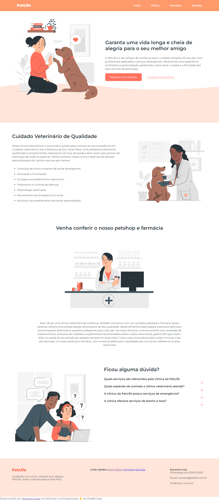

# 🐾 PetLife

## 📜 Descrição

O PetLife é um site dedicado ao cuidado e bem-estar dos pets. Nele, oferecemos informações sobre serviços veterinários, farmácia para pets, e um espaço para tirar dúvidas. O objetivo é proporcionar aos donos de animais uma experiência completa e acolhedora para garantir a saúde e felicidade dos seus amigos de quatro patas.

## 🖥️ Projeto

Neste projeto, desenvolvemos um site responsivo que apresenta todos os serviços da PetLife, com um design amigável e intuitivo.

### 🔎 Tecnologias

Esse projeto foi desenvolvido com as seguintes tecnologias:

- **HTML5**: Estrutura do site.
- **CSS3**: Estilização e layout responsivo.
- **JavaScript**: Interatividade e funcionalidades dinâmicas.
- **GitHub**: Controle de versão e colaboração.

### 🚀 Funcionalidades

- Seções para informações sobre a clínica, farmácia e serviços oferecidos.
- Links diretos para agendamentos via WhatsApp.
- Seção de perguntas frequentes para esclarecer dúvidas comuns dos donos de pets.

### 📸 Demonstração



### 📁 Instalação

Para visualizar o projeto localmente:

1. Clone o repositório:
   ```bash
   git clone https://github.com/seuusuario/petlife.git
   ```
2. Navegue até a pasta do projeto:
   ```bash
   cd petlife
   ```
3. Abra o arquivo index.html em seu navegador.
